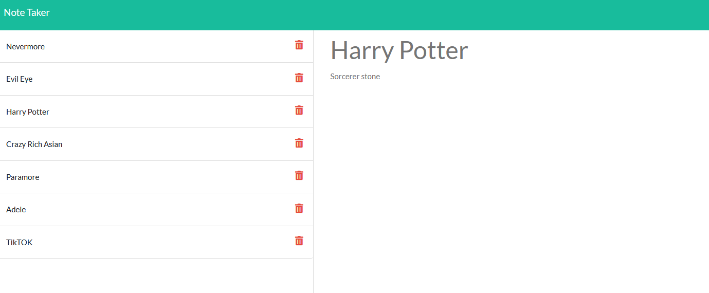

  ## Description
  Created with VSCode and utilizing Express Package.
  This app allows users to create and save notes that be looked back later on. 
  
  ## Installation
  `npm install` from terminal after code is cloned

  ## Example Image
  

  ## Heroku
  App can be found [here](https://note-creation.herokuapp.com/)